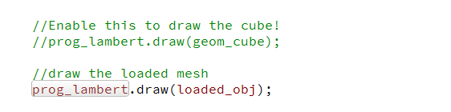
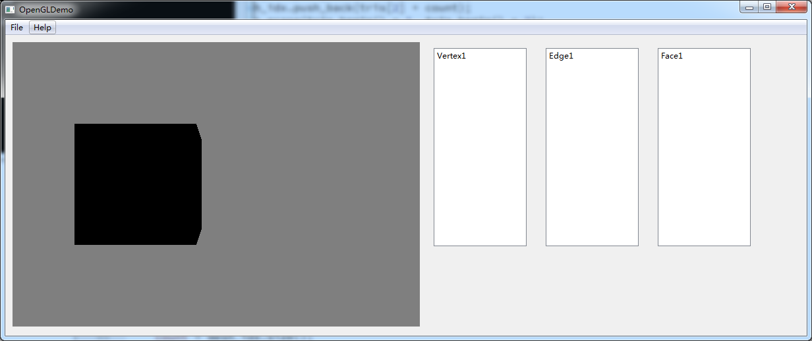
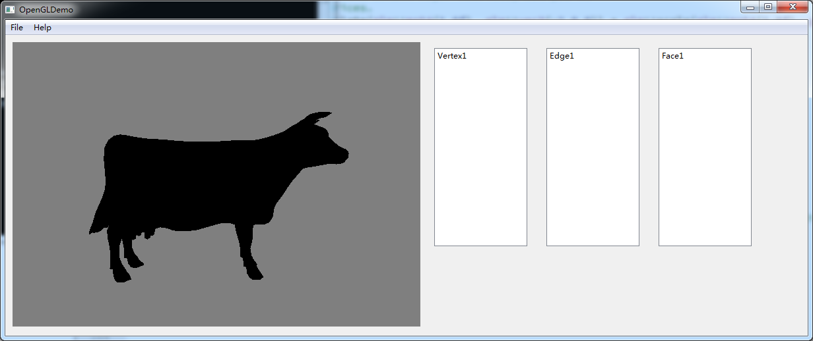

# CIS_560_HW5

## Questions: 

(1)Given a mesh with all of its half-edges created but none of its SYM pointers set, what is the minimum information needed to determine which half-edge should be the SYM of some other half-edge?

Answer: If the two halfedge->vertex are connected, then they are symmetric halfedges.

(2) Given the parallel nature of OpenGL shader execution, what do you suppose is a downside to using branching statements (e.g. if statements) in a shader program?

Answer: Since GPU will run all the code parallelly, it will NOT jump over the codes in "if" when the statement is not true. Therefore, branching saves no time. 

## Functions: 

In "half_edges": 
1. Classes of Vertex, Face, HalfEdges, Mesh
2. Half Edge Structure Composition

In "mygl":
3. The loading obj function
(location is hard-coded, after building, plz put the objs into the builded folder! )
4. Switch between hard-coded cube and loaded objs.
Modify at here in mygl.cpp

Notice that the cow is very giant, so we need to press S to step back a little bit to view it! 

## Bugs: 

1. Qt UI unfinished. (Although I finished them later in HW6 and HW7) 
2. Currently no color, just a black cow! (See the scrrenshots)

This is the hand-created cube

And this is the loaded cow

